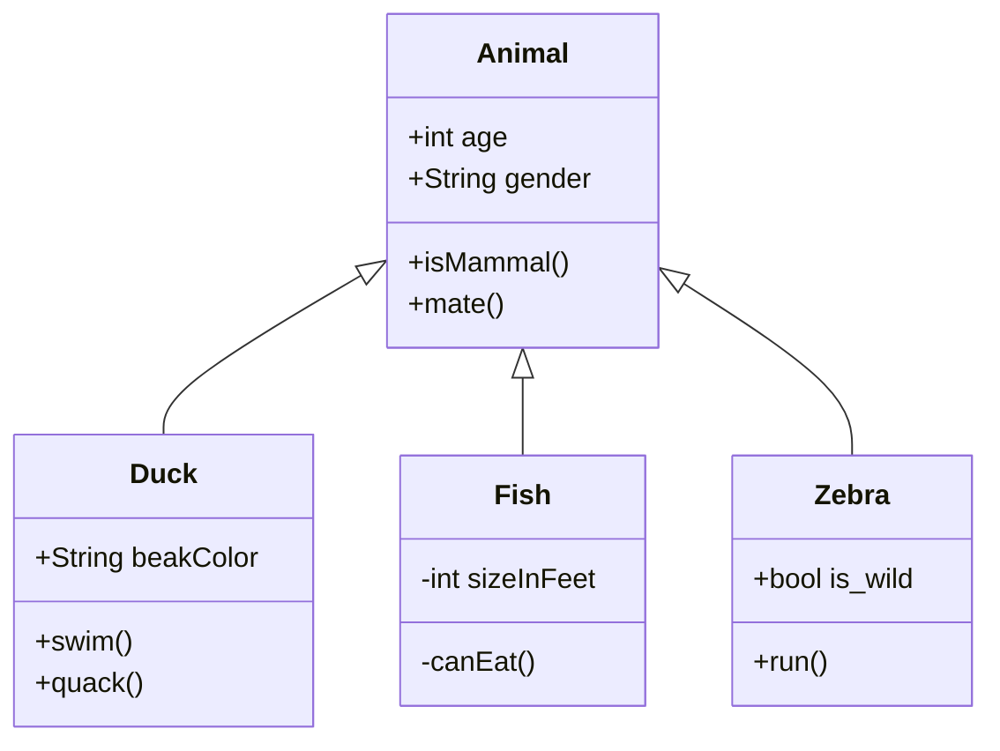

# A11yjson diagram
Figuring out the hierarchy of the A11yJSON interfaces was (and is) a bit of a struggle. So I'll try to visually reflect the nesting of the interfaces here.

## Example mermaid diagram

[Mermaid docs](https://mermaid-js.github.io/mermaid/#/)
Alternatively it's possible to [integrate draw.io](https://drawio.freshdesk.com/support/solutions/articles/16000042371-embed-a-diagram-in-github-markdown) in github